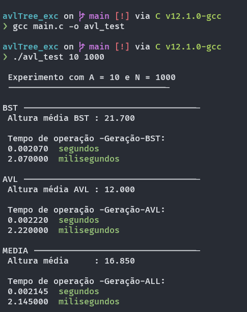

# EP2
Projeto de estrutura de dados correlação à BST's ordinárias e BST's AVL

### Informações básicas

- Projeto compilado com gcc v12.1.0
- Ambiente WSL2 Arch Linux
- Exemplo de uso: 
  > ./programa <amostras> <nós>
  > ./avl_test 1600 3200
  
  recepção por argumentos acelera o teste do programa, por isso não usei scanf.
  
  

## Estrutura do programa
### Organização

O programa foi dividido em 3 partições principais:

- main.c com funções específicas do projeto
  - fill_avl
  - print_time
  
   
  
- parte da pasta libs com funções necessárias no projeto
  - j_avlTree.h
  - j_binaryTree.h
 
  
 
- jg-tools com funções auxiliares

 

### Estruturas de dados principais

- Árvore BST localizada no arquivo j_binaryTree
  - bNode : Estrutura do nó
  - bTree : Estrutura da árvore
 
 

- Árvore AVL localizada no arquivo j_avlTree
  - aNode : Estrutura do nó
  - aTree : Estrutura da árvore

Ambos os conjuntos são parecidos, suas funções se baseiam no uso geral das estruturas,
apresentam a maioria de suas aplicações principais, apesar de que faltam algumas coisas pelo fato 
de que foram feitas para este EP em específico, como o rebalanceamento de uma AVL em caso de remoção,
ou de uma otimização geral em relação às duas para acertar as posições certas das chamadas de funções de cálculo.

Também foram feitos poucos testes correlação à vazamento de memórias, em partes porque o valgrind quebrou
no meio da semana '-'.

É importante mencionar que as únicas funções que devem ser chamadas pelo usuário não começam com "__", as que 
obedecem este padrão são puramente funções de uso do programa, eu não acho pertinente explicar muito sobre as 
funções presentes já que as únicas usadas foram:
- bst_New
- bst_Insert

- avl_New
- avl_Insert
 
 

## Geração de elementos aleatórios e discussão sobre o projeto

Não vou aprofundar muito na geração de elementos aleatórios, ele gera números com base na quantidade de nós
solicitadas no programa para que não falte e para que não sofra muito com colisões, e se um número gerado já existe
na árvore, ela retorna falso, fazendo com que o programa recalcule a inserção.

Em relação ao projeto, a árvore avl mesmo quando testada com milhares de nós e amostras, apresentava a altura esperada,
ou seja a altura perfeita no contexto, mas curiosadamente, **vezes mostrava uma média 0.1 ou 0.01 abaixo**, quando eu digo
vezes, eu digo que em dezenas de testes com 10000 amostras isto acontecia, **devido a uma probabilidade tão baixa eu chuto
que deve ser um problema com pontos flutuantes**.

Outra curiosidade, é que contra-intuitivamente a **BST apresentou uma média de tempo de geração maior que a AVL** na maior
parte dos casos, o que não faz sentido, e assumi duas razões possíveis, um problema de otimização na BST como antes
mencionado ou uma aceleração no sistema nas opções da AVL, que são obviamente mais taxantes.
